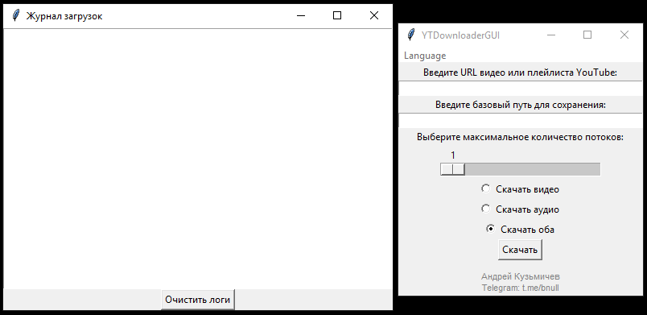
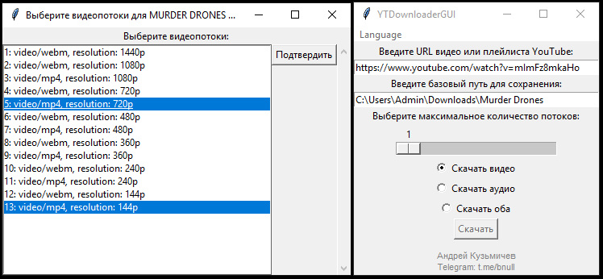
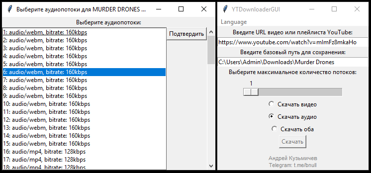
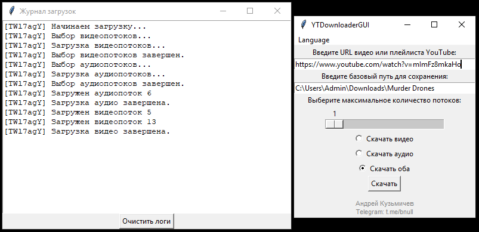
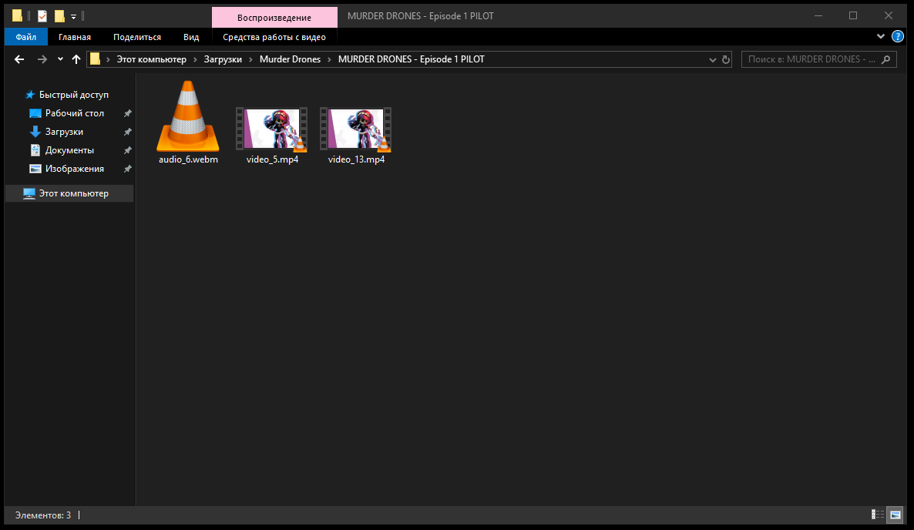

# YTDownloaderGUI

YTDownloaderGUI - это приложение для загрузки видео и аудио с YouTube, разработанное на Python с использованием
библиотеки tkinter для графического интерфейса пользователя. Приложение поддерживает выбор языков (русский и
английский), загрузку отдельных видео или целых плейлистов, а также выбор аудио и видео потоков для загрузки.

## Функции

- Загрузка видео с YouTube
- Загрузка аудио с YouTube
- Загрузка плейлистов с YouTube
- Выбор видео и аудио потоков для загрузки
- Многоязычная поддержка (русский и английский)
- Журнал загрузок для мониторинга процесса загрузки

## Установка

1. Клонируйте репозиторий:
    ```bash
    git clone https://github.com/Andrey-Kuzmichev/YTDownloaderGUI.git
    cd YTDownloaderGUI
    ```

2. Установите необходимые зависимости:
    ```bash
    pip install -r requirements.txt
    ```

## Использование

1. Запустите приложение:
    ```bash
    python ./
    ```

2. Введите URL видео или плейлиста YouTube в соответствующее поле.

3. Укажите путь для сохранения загруженных файлов.

4. Выберите количество потоков для многопоточной загрузки.

5. Выберите тип загрузки: видео, аудио или оба.

6. Нажмите кнопку "Скачать".

7. Статус загрузки можно отслеживать в окне "Журнал загрузок".

## Загрузка EXE файла

Вы можете скачать готовый exe файл приложения [здесь](https://github.com/Andrey-Kuzmichev/YTDownloaderGUI/releases).

## Упаковка в exe файл с помощью PyInstaller

Вы также можете запаковать приложение в exe файл самостоятельно, используя PyInstaller:

1. Запустите скрипт:
    ```bash
    python auxiliary/convert_exe.py
    ```

2. Найдите скомпилированный exe файл в папке `dist`.

## Соединение видео и аудио

1. Скачайте FFmpeg [здесь](https://ffmpeg.org/download.html)

2. Теперь для соединения видео и аудио в один файл вы можете использовать скрипт `auxiliary/video_audio_combiner.py`.

3. Укажите путь к исполняемому файлу FFmpeg и папке с видео/аудио файлами.
    1. **Обязательно** измените расширение видео и аудио в строке 20,22 и 33.

4. Запустите скрипт:
   ```bash
   python auxiliary/video_audio_combiner.py
   ```

## Скриншоты

### Главное окно



### Выбор потоков видео



### Выбор потоков аудио



### Окно логов



### Итог



## Вклад

Ваши вклады приветствуются! Если вы хотите улучшить проект, пожалуйста, создайте pull request или откройте issue.

## Лицензия

Этот проект лицензирован под лицензией Apache-2.0. Подробнее см. в файле [LICENSE](LICENSE).

## Контакты

- **Автор:** Андрей Кузьмичев
- **Telegram:** [@bnull](https://t.me/bnull)
